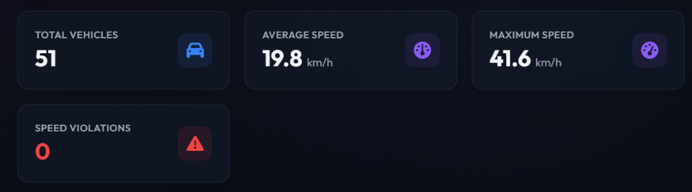
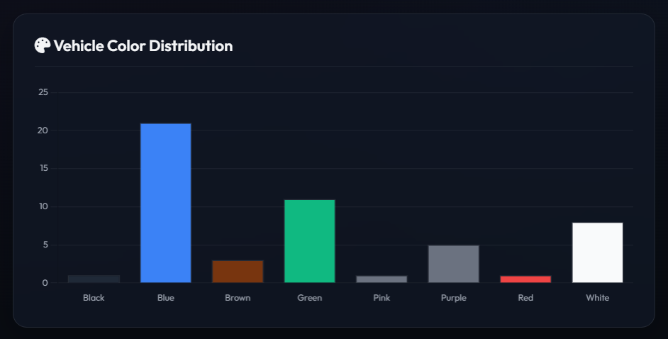
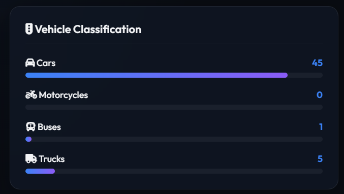

# Smart Vehicle Surveillance System

An AI-powered traffic surveillance and monitoring platform built with **Python**, **OpenCV**, **YOLOv8**, **ByteTrack**, **EasyOCR**, and **Flask**.

The system allows users to upload traffic footage, calibrate perspective coordinates for homography-based speed calculations, track vehicles across frames, classify attributes (type, color), read license plates via EasyOCR, and log speed violations.

---

##  Analytics Dashboard Preview

Here is the analytics dashboard generated by the system after processing traffic footage:

### Telemetry Metrics


### Vehicle Attribute Analysis



---

##  Key Features

1. **Pure Upload & Analyze Workflow**: Clean, modern interface showing *only* the uploader and calibration accordion on start. No statistics, charts, or video players are rendered before a video is uploaded.
2. **Advanced Perspective Calibration**: A collapsible settings panel allowing users to configure speed limits, road dimensions (meters), and the 4-point coordinate quad mapping frame coordinates to flat birds-eye view (BEV) meter space.
3. **Real-time Processing Telemetry**: Displays a real-time progress bar (0–100%) and a dynamic counter of unique **Vehicles Detected** during background worker analysis.
4. **Annotated Processed Video Player**: Plays the annotated output video inline inside the browser using HTML5 controls (with green/red bounding boxes mapping safe/overspeeding vehicles).
5. **Session Download Suite**: Download the processed video, detailed CSV logs, or a clean text summary report (`summary_video_{id}.txt`) directly from the dashboard.
6. **Dynamic Analytical Charts**: Renders category distribution charts (doughnut) and dominant vehicle color distributions (bar chart) matching actual color codes.
7. **Violations Database & Evidence Log**: Saves cropped screenshots of overspeeding vehicles in `/violations` and logs telemetry inside a SQLite database.

---

##  Project Structure

```
vehicle-monitoring/
│
├── app.py                  # Server entrypoint (initializes directories and runs Flask)
├── dashboard.py            # Flask endpoints (routing upload, status, reports, and downloads)
├── video_worker.py         # Background worker executing YOLOv8 + ByteTrack + Homography pipeline
├── detector.py             # YOLOv8 vehicle detection wrapper
├── tracker.py              # ByteTrack tracking interface
├── speed_estimator.py      # Homography-based birds-eye view speed calculation
├── attribute_detector.py   # OpenCV K-Means color extractor & HSV classifier
├── plate_reader.py         # EasyOCR reader with rate-limited caching
├── database.py             # SQLite helper (schema, session logs, metrics query)
├── requirements.txt        # PIP dependencies
├── README.md               # Documentation
│
├── static/
│   └── css/
│       └── style.css       # Premium glassmorphic styling
├── templates/
│   └── index.html          # Dynamic wizard-step dashboard HTML & JS
│
├── videos/
│   ├── uploads/            # Uploaded raw videos (git-ignored)
│   └── outputs/            # Processed annotated videos (git-ignored)
├── violations/             # Bounding box crops of speed violations (git-ignored)
└── logs/
    ├── reports/            # CSV logs and summary text exports (git-ignored)
    └── traffic_surveillance.db # SQLite database (git-ignored)
```

---

## Installation & Setup

### 1. Clone & Navigate
Ensure you are in the project workspace folder:
```powershell
cd "d:\Desktop\Vehicle Monitoring System"
```

### 2. Set Up Virtual Environment (Recommended)
```powershell
python -m venv venv
# Activate on Windows:
venv\Scripts\Activate.ps1
# Activate on Linux/macOS:
source venv/bin/activate
```

### 3. Install Dependencies
```powershell
pip install -r requirements.txt
```

---

##  Running the Platform

1. Start the Flask application:
   ```powershell
   python app.py
   ```
2. Open your browser and navigate to:
    **[http://127.0.0.1:5000](http://127.0.0.1:5000)**

---

##  Database Schema

The SQLite database (`logs/traffic_surveillance.db`) is initialized automatically on server boot with the following tables:

### 1. `videos`
Tracks upload sessions and processing metrics:
* `id` (INTEGER PRIMARY KEY AUTOINCREMENT)
* `filename` (TEXT)
* `filepath` (TEXT)
* `output_filepath` (TEXT)
* `upload_time` (TEXT)
* `status` (TEXT) - 'pending', 'processing', 'completed', 'failed'
* `progress` (REAL)
* `total_vehicles`, `avg_speed`, `max_speed`, `min_speed`, `overspeeding_count`
* Class counts (`cars_count`, `bikes_count`, `buses_count`, `trucks_count`)

### 2. `vehicles`
Logs every unique vehicle tracked per video session:
* `id` (INTEGER PRIMARY KEY)
* `vehicle_id` (INTEGER) - Tracking ID
* `video_id` (INTEGER) - Session ID mapping to `videos.id`
* `type` (TEXT) - Car, Motorcycle, Bus, Truck
* `color` (TEXT) - Classified dominant color
* `max_speed` (REAL) - Maximum speed recorded
* `plate_number` (TEXT) - OCR parsed plate
* `timestamp` (TEXT) - Detection timestamp
* `violation_status` (INTEGER) - 1 if overspeeding, 0 if safe

### 3. `violations`
Logs evidence records of speed limit violations:
* `id` (INTEGER PRIMARY KEY)
* `vehicle_id` (INTEGER)
* `video_id` (INTEGER) - Mapped to session ID
* `type`, `color`, `speed`, `plate_number`, `timestamp`
* `image_path` (TEXT) - Screenshot filename in `violations/`
